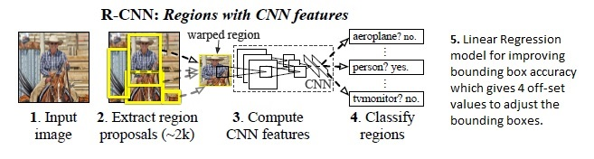

# object-detection
Object detection
# Detecting object, using region-proposal based CNN

Following steps will be performed to detect and localize object using region proposal:

1. Select an image with one object only.
2. Extract candidate region i.e. region proposals within the given image.
3. Calcualte how close the candidate is to the actual object location:
  * Calculate IoU
4. Candidate is considered to contain the object of interest if the intersection over the union (IoU) is greater than a certain threshold.
  * This creates the label for each candidate region,
5. Next, use VGG16 model to extract features of the candidates. Resize the candidate image before passing it to pre-trained VGG16 network.
6. Next, create the training data of the bounding box correction by comparing the location of the candidate and the actual location of an object.
7. Build a classification model that maps the features of the candidate to the output of wheather the region contains an object.
8. For the regions that contain an image ( as per the model), build a regression model that maps the input features of the candidate to the correction required to extract the accurate bouding box of an object.
9. Perform non-max suppression on top of the resulting bounding boxes:
  * Non-max suppression ensures that the candidates that overlap a lot are reduced to 1, where only the candidates that has the highest probability of containing an object is left
10. By performing a non-max suppression, we would be in a position to replicate the model that we built for images that contain multiple objects within the image too.

# Introduction
_Object detection_ is integral part of _compter vision_. Applications of _object detections_ include _pose estimation, vehicle detection, surveillance etc_. Object detection is different from image classification algorithms. Object detection algorithms draw a bounding box around the object of interest to locate that image within a given image. We may draw multiple bouding-boxex in an image to detect mulitple objects.

We cannot use standard CNN for object detection. 
Major reason, we cannot use CNN because the output layer is variable i.e. the number of occurances of the object is not fixed. 
A naive data scientist can use a CNN to classify the presence of object of interest across different regions of the image. However, this can be computationally very expensive. Therefore, researchers and data scientist use R-CNN, YOLO.
# R-CNN
Ross Girshick et al. proposed a lean method to extract just 2000 regions from the image of interest; he called these extracted regions as region proposals. With this approch ( with only 2000 region proposals), one needs to work with only 2000 regions. 
* Selective search algorithm is used to generate 2000 region proposals. More about the _selective search_ algorithm can be found in the paper of Uijlings et al. [https://ivi.fnwi.uva.nl/isis/publications/2013/UijlingsIJCV2013/UijlingsIJCV2013.pdf]

Next the 2000 candidate regions in an image are warped into a square and fed into a CNN tha produces a 4096 dimensional feature vector as output i.e. the CNN extracts features. These extracted features are fed into a SVM classifier to classify the presence or absence of the object within the candidate region proposal. In addition, a regression model predicts four offset values to increase the precision of bounding box. 

* The predicted four values are _offset values_. e.g. assume a given region proposal, the CNN extracted features when fed into SVM classifier predicts presence of a person but the face of that person within that region proposal could have been cut in half. Therefore, the offset values help in adjusting the bounding box of the region proposal.

Components of R-CNN:

* 2000 Bounding boxes i.e. region proposal from selective search.
* CNN to extract features
* SVM to classify presence or absence of feature.
* Regression modelt to get 4 _offset values._
